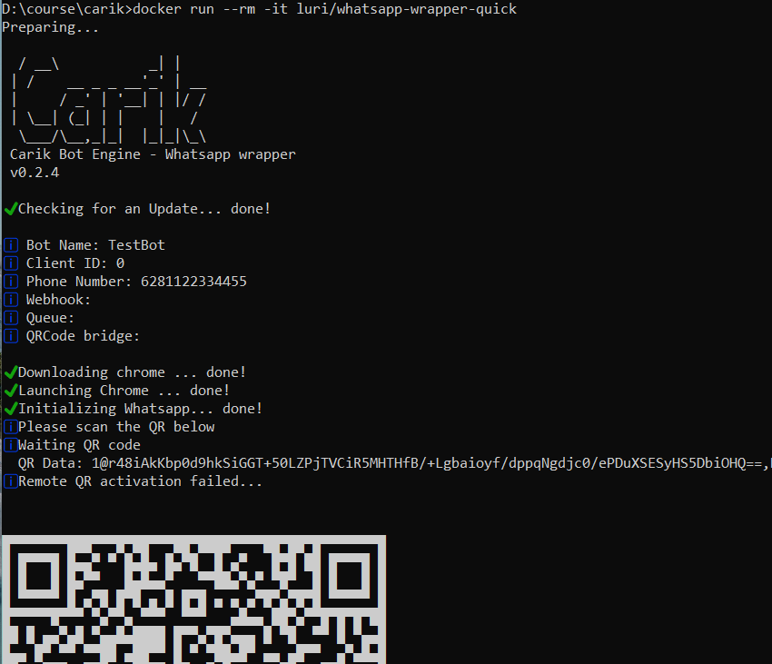

# Whatsapp Loader with Docker

Super lite whatsapp loader for chat bot development.

## Usage

### Build

```bash
docker build . -t mywhatsapp

# or, if you need more quicker wrapper, use 
docker build . -t mywhatsapp -f Dockerfile-quick

```

### Run

```bash
docker run --rm -it mywhatsapp
```

### Compose

```bash
docker-compose up --build
```

## Configuration

```json
{
  "appconfig": {
    "botName": "ExampleBot",
    "phoneNumber": "6281122334455",
    "token": "0000",
    "clientId": 0,
    "debug": true,
    "headless": true,
    "isGroupReply": false,
    "downloadMedia": false,
    "replyUnreadMsg": true,
    "webhook": "",
    "outgoingQueue": "",
    "qrcodebridgeUrl": ""
  },
  "blocked": [
    ""
  ]
}
```

| Key | Description | Example |
|---|---|---|
| botName | Your Bot Name | SuperSmartBot |
| phoneNumber | Whatsapp number in international format, without + sign. | 62812345678 |
| token | reserved ||
| clientId | reserved ||
| debug | verbose debug information | false |
| headless | It can be used to automate things that normally performed manually in the browser, such as submitting forms, UI testing, keyboard input, or capturing a timeline trace to diagnose performance. | true |
| isGroupReply | Enabling chat bots in groups | false |
| downloadMedia | Download media sent by user | false |
| replyUnreadMsg | Replay all unread messages  | false |
| webhook | API endpoint that will handle all incoming message. _Read API Doc_.<br>ex: https://yourdomain/api/handler | |
| outgoingQueue | API endpoint that periodically fetch message data to be sent. | |
| qrcodebridgeUrl | API endpoint that will handle QR Code verification each setup web whatsapp | |


## Resource

- [Whatsapp Wrapper Docker](https://hub.docker.com/u/luri)
- [Whatsapp Wrapper Github](https://github.com/luridarmawan/whatsapp-bot-docker)
- [Docker Desktop](https://www.docker.com/products/docker-desktop)

<br>



<hr>
<br>

## 📃 Legal
This code is in no way affiliated with, authorized, maintained, sponsored or endorsed by WhatsApp or any of its affiliates or subsidiaries. This is an independent and unofficial software. Use at your own risk.
**Commercial use of this code/repo is strictly prohibited.**
